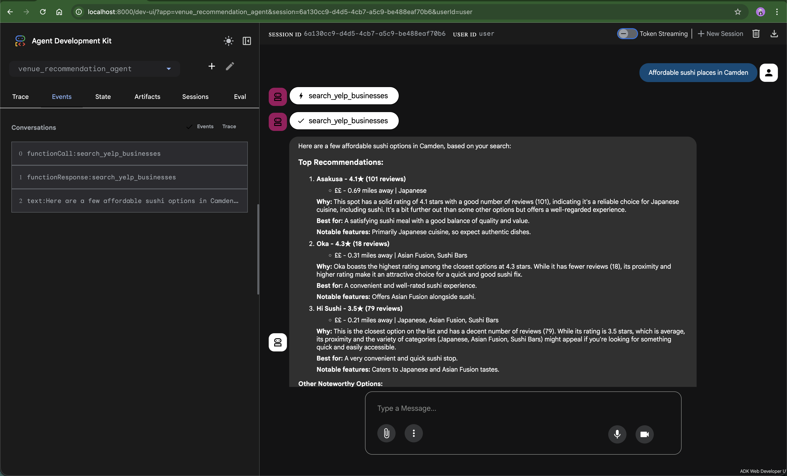
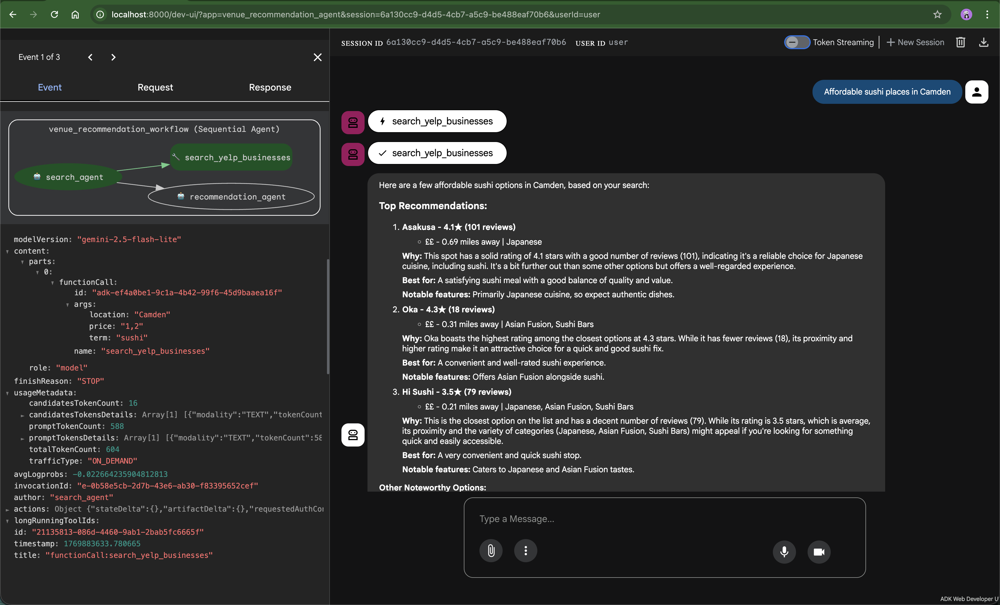
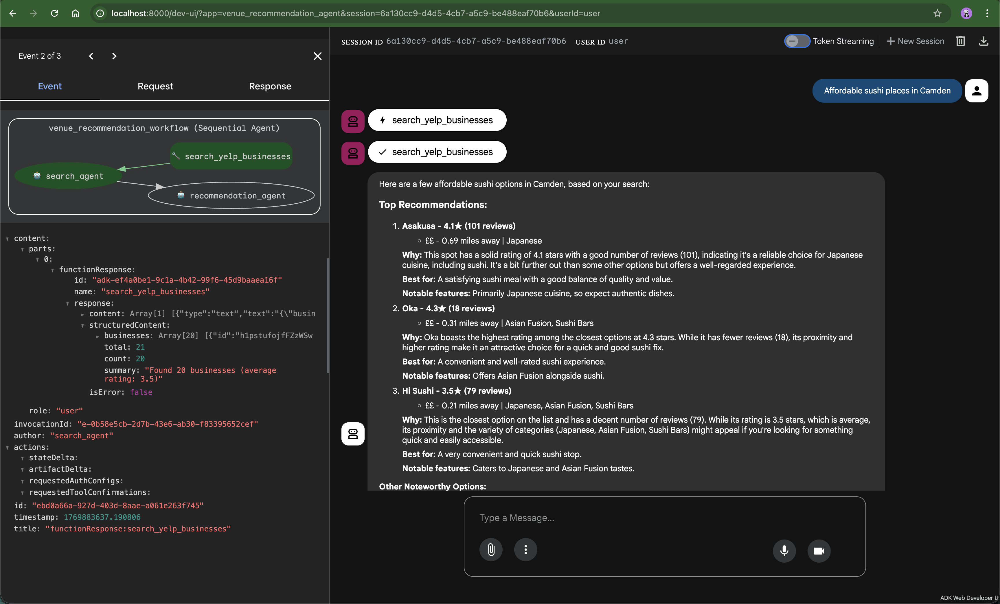
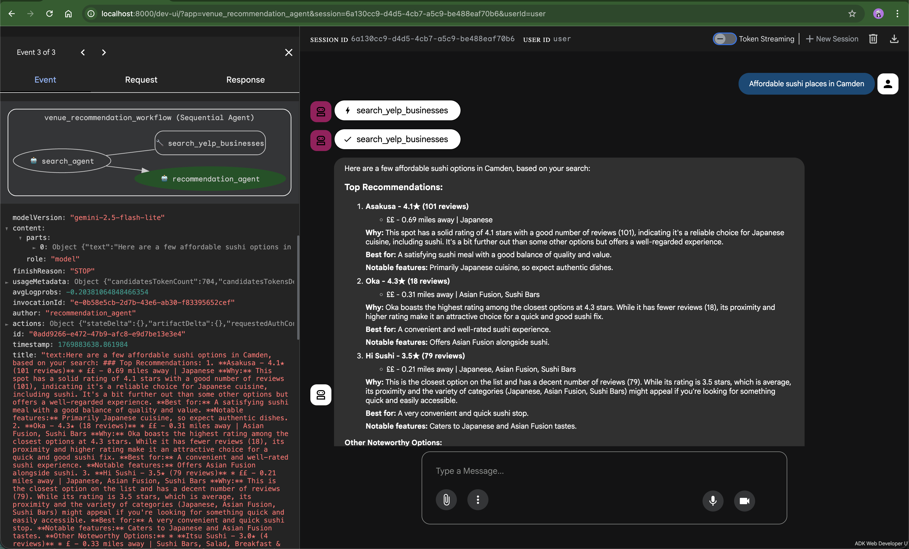

# Venue Recommendation Agent

A Google ADK-powered multi-agent AI system that provides intelligent venue recommendations using the Yelp Places API.

## Features

- **Natural language queries** - Just describe what you want
- **Multi-criteria analysis** - Price, ratings, distance, ambiance, cuisine type
- **Intelligent reasoning** - Context-aware recommendations with detailed rationale
- **Multi-agent architecture** - Search Agent (retrieval) → Recommendation Agent (analysis)
- **Real-time data** - Live Yelp business information
- **MCP Protocol** - FastMCP server connects ADK agents to Yelp API

## Screenshots

**Event Timeline:**



**Function Call to Yelp API:**



**Function Response from Yelp:**



**Agent Response with Recommendations:**



## Quick Start

### Prerequisites

- Python 3.14
- [uv](https://github.com/astral-sh/uv) package manager
- Yelp API key ([Get one here](https://www.yelp.com/developers))
- **Google Authentication** (choose one):
  - **Option 1:** Google API key for Gemini ([Get one here](https://aistudio.google.com/apikey))
  - **Option 2:** Google Cloud Application Default Credentials (run `gcloud auth application-default login`)

### Setup

**1. Install dependencies:**

```bash
uv sync
```

**2. Configure authentication:**
```bash
cp .env.example .env
```

Edit `.env` and configure your authentication:

**Option 1: Using API Keys**
```env
YELP_API_KEY=your_actual_yelp_api_key
GOOGLE_API_KEY=your_actual_google_api_key
GEMINI_MODEL=gemini-2.5-flash-lite # Optional
```

**Option 2: Using Application Default Credentials (ADC) with Vertex AI**
```env
YELP_API_KEY=your_actual_yelp_api_key
# GOOGLE_API_KEY=  # Comment out or leave empty to use Vertex AI
VERTEX_PROJECT=your-gcp-project-id  # Required for Vertex AI
VERTEX_LOCATION=europe-west1  # Optional, defaults to europe-west1
GEMINI_MODEL=gemini-2.5-flash-lite # Optional
```

Then authenticate with Google Cloud:
```bash
gcloud auth application-default login
```

**3. Launch the Web UI:**
```bash
uv run web-ui
```

Open [http://localhost:8000/dev-ui/?app=venue_recommendation_agent](http://localhost:8000/dev-ui/?app=venue_recommendation_agent) in your browser.

**Note:** The MCP server is automatically launched as a subprocess by the ADK app - no need to run it manually.

## Usage

Type natural language queries in the web UI:

```
"Find romantic Italian restaurants for a date night in Shoreditch"
"Best coffee shops with WiFi near Covent Garden"
"Affordable sushi places in Camden under £20 per person"
"Show me highly-rated Thai restaurants within walking distance in Soho"
```

**Important:** Always include a location (e.g., "in Shoreditch", "near Camden", "London").

### Query Tips

| What you say       | What it understands                    |
|--------------------|----------------------------------------|
| "Date night"       | Higher-end (££-£££), romantic ambiance |
| "Quick lunch"      | Fast service, affordable (££), nearby  |
| "Coffee and work"  | WiFi, quiet, good seating              |
| "Under £20/person" | Budget constraint (price: "1,2")       |
| "Walking distance" | Small radius (~500m)                   |
| "Open now"         | Filter for currently open venues       |

## Architecture

### System Flow

```
User Query (Web Browser)
    ↓
Google ADK Web Server
    ↓
Search Agent (Google ADK + Gemini)
    ↓
MCP Protocol (stdio)
    ↓
FastMCP Server (separate process) → Yelp Places API
    ↓
Search Results
    ↓
Recommendation Agent (Google ADK + Gemini)
    ↓
User (receives personalised recommendations only)
```

### Agent Communication

- **Search Agent**: Queries Yelp API via MCP tool to find businesses
- **Recommendation Agent**: Analyses results and provides ranked recommendations
- **Data Flow**: Search Agent finds venues → Recommendation Agent ranks and explains choices → User sees final recommendations
- **Events Compaction**: Summarises earlier conversation turns to enable longer conversations without hitting token limits, reducing cost and latency

### Technology Stack

- **Google ADK** - Multi-agent orchestration framework
- **Google Gemini** - LLM (gemini-2.5-flash-lite)
- **FastMCP** - Connects agents to Yelp API
- **Yelp Fusion API** - Business data
- **Python 3.14** + **uv** (package manager)

### Why Multi-Agents?

- **Search Agent**:
  - Has access to `search_yelp_businesses` MCP tool
  - Lower temperature (0.3) for accurate parameter extraction
  - Retrieval specialist
- **Recommendation Agent**:
  - No tools - pure reasoning agent
  - Higher temperature (0.7) for creative recommendations
  - Analysis specialist
- **Clean separation**: Each agent focuses on what it does best

## Project Structure

```
venue-recommendation-agent/
├── docs/
│   └── screenshots/         # Demo screenshots
├── src/
│   ├── venue_recommendation_agent/  # Multi-agent system (Google ADK)
│   │   ├── agent.py         # Root agent + MCP setup + web server
│   │   ├── search_agent.py
│   │   ├── recommendation_agent.py
│   │   └── prompts/
│   ├── mcp_server/          # FastMCP server
│   │   ├── server.py        # MCP server + tool registration
│   │   ├── exceptions.py    # Yelp API exceptions
│   │   └── yelp/            # Yelp API client
│   └── config.py            # Configuration and environment settings
├── tests/
├── .env.example
├── pyproject.toml
└── README.md
```

## Tests

The project includes comprehensive unit and integration tests. For detailed test documentation, architecture, and examples, see **[tests/README.md](tests/README.md)**.

### Quick Start

```bash
# All tests (unit + integration)
uv run pytest

# Unit tests only (fast, no API keys required)
uv run pytest -m "not integration"

# Integration tests (requires valid API keys in .env)
uv run pytest -m integration
```

- Unit tests: Fully mocked, no external dependencies
- Integration tests: Real API calls to Yelp and Google Gemini
- End-to-end tests: Full multi-agent workflow validation

See the [full test documentation](tests/README.md) for further details on test structure.

## Development

### Code Formatting
```bash
uv run black src/
uv run ruff check src/
```

### Type Checking
```bash
uv run pyright src/
```

## Troubleshooting

### "API key must be set to a valid value"
- Create `.env` file with valid API keys (no placeholder values)
- Check keys have no spaces, quotes, or "your_" prefix
- For Google authentication, you can use ADC instead (see Setup section)

### "Google API rate limit exceeded" or "RESOURCE_EXHAUSTED"
- **Free tier limit:** Google API keys have limited quota (see https://aistudio.google.com/usage)

### "Missing key inputs argument" error with ADC
- Ensure `VERTEX_PROJECT` is set in `.env` when using Vertex AI with ADC
- Example: `VERTEX_PROJECT=my-gcp-project-id`
- Make sure you've run `gcloud auth application-default login`

### "Yelp API rate limit exceeded"
- Wait a few moments before trying again
- Yelp free tier has rate limits

### "MCP server connection failed"
- Check `.env` has correct `YELP_API_KEY`
- Verify `uv` command is available in `PATH`
- Check terminal output for MCP server subprocess errors

### "No businesses found"
- Broaden search radius
- Use more general search terms
- Verify location string is valid
- Remove price or category filters

### Web UI won't load
- Check port `8000` is not already in use
- Try [http://127.0.0.1:8000](http://127.0.0.1:8000]) instead
- Check terminal for error messages

### "Module not found"
- Run `uv sync` to install dependencies
- Ensure running from project root directory

## MCP Tool Reference

### search_yelp_businesses

Searches for businesses matching criteria.

**Key Parameters:** `location` (required), `term`, `categories`, `price`, `radius`, `limit`, `sort_by`, `open_now`

**Returns:** List of businesses with ratings, reviews, price, distance, and address.
